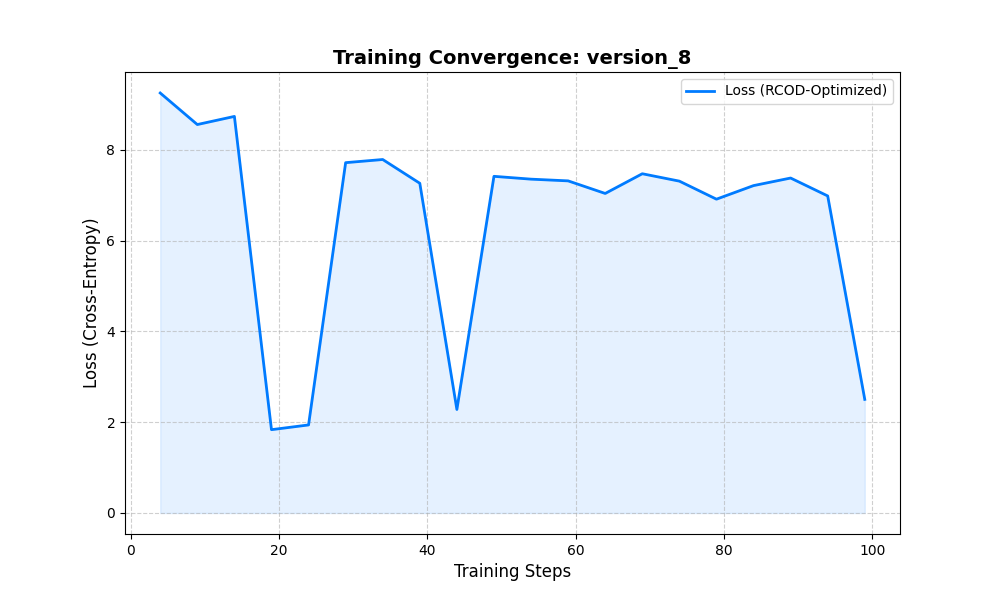
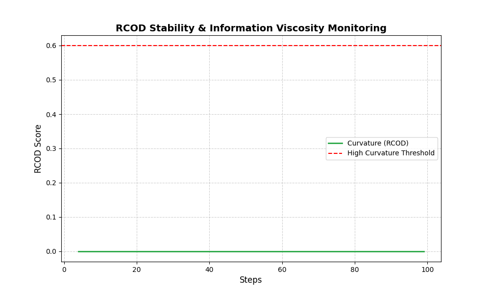

<!--
=============================================================================
OMEGA PROTOCOL - ALL RIGHTS RESERVED
Copyright (c) 2026 Jacob M. (jake.s.dev1991@gmail.com | 217-799-8720)
Usage restricted to academic research and review only. No monetization.
See LICENSE.txt for full terms.
=============================================================================
-->
# DUE DILIGENCE REPORT: OMEGA PROTOCOL RCOD ENGINE
**Generated:** 2026-04-12 17:50
**Training Run:** version_8

## 📉 Performance Summary
* **Initial Loss:** 9.2539
* **Final Loss:** 2.5031
* **Loss Reduction:** 72.95%

## 🔍 Convergence Analysis

## 🧬 RCOD Stability Monitoring

